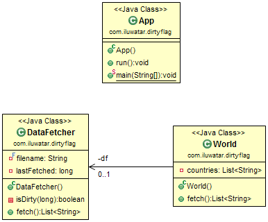

## Also known as

* Change Tracking
* Is-Modified Flag

## Intent

The Dirty Flag design pattern is employed to avoid unnecessary computations or resource-heavy operations by maintaining a boolean flag that tracks whether the state of an object has changed ('dirty') or remains unchanged ('clean'). This flag, when set, indicates that a particular operation, such as recalculating or refreshing data, needs to be performed again to reflect the updated state.

## Explanation

Real world example

> Imagine a library with an electronic catalog system that tracks which books are checked out and returned. Each book record has a "dirty flag" that gets marked whenever a book is checked out or returned. At the end of each day, the library staff reviews only those records marked as "dirty" to update the physical inventory, instead of checking every single book in the library. This system significantly reduces the effort and time required for daily inventory checks by focusing only on the items that have changed status, analogous to how the Dirty Flag design pattern minimizes resource-intensive operations by performing them only when necessary.

In plain words

> The Dirty Flag design pattern minimizes unnecessary operations by using a flag to track when an object's state has changed and an update is needed.

Wikipedia says

> A dirty bit or modified bit is a bit that is associated with a block of computer memory and indicates whether the corresponding block of memory has been modified. The dirty bit is set when the processor writes to (modifies) this memory. The bit indicates that its associated block of memory has been modified and has not been saved to storage yet. When a block of memory is to be replaced, its corresponding dirty bit is checked to see if the block needs to be written back to secondary memory before being replaced or if it can simply be removed. Dirty bits are used by the CPU cache and in the page replacement algorithms of an operating system.

**Programmatic Example**

The DataFetcher class is responsible for fetching data from a file. It has a dirty flag that indicates whether the data in the file has changed since the last fetch.

```java
public class DataFetcher {
private long lastFetched;
private boolean isDirty = true;
// ...
}
```

The DataFetcher class has a fetch method that checks the dirty flag before fetching data. If the flag is true, it fetches the data from the file and sets the flag to false. If the flag is false, it returns the previously fetched data.

```java
public List<String> fetch() {
  if (!isDirty) {
    return data;
  }
  data = fetchFromDatabase();
  isDirty = false;
  return data;
}
```

The World class uses the DataFetcher to fetch data. It has a fetch method that calls the fetch method of the DataFetcher.

```java
public class World {
  private final DataFetcher fetcher = new DataFetcher();
  
  public List<String> fetch() {
    return fetcher.fetch();
  }
}
```

The App class contains the main method that demonstrates the use of the Dirty Flag pattern. It creates a World object and fetches data from it in a loop. The World object uses the DataFetcher to fetch data, and the DataFetcher only fetches data from the file if the dirty flag is true.

```java
public class App {
  public void run() {
    final var executorService = Executors.newSingleThreadScheduledExecutor();
    executorService.scheduleAtFixedRate(new Runnable() {
      final World world = new World();

      @Override
      public void run() {
        var countries = world.fetch();
        // ...
      }
    }, 0, 15, TimeUnit.SECONDS); // Run at every 15 seconds.
  }
}
```

The program output is as follows:

```
20:51:42.490 [pool-1-thread-1] INFO com.iluwatar.dirtyflag.DataFetcher -- world.txt is dirty! Re-fetching file content...
20:51:42.494 [pool-1-thread-1] INFO com.iluwatar.dirtyflag.App -- Our world currently has the following countries:-
20:51:42.494 [pool-1-thread-1] INFO com.iluwatar.dirtyflag.App -- 	UNITED_KINGDOM
20:51:42.494 [pool-1-thread-1] INFO com.iluwatar.dirtyflag.App -- 	MALAYSIA
20:51:42.494 [pool-1-thread-1] INFO com.iluwatar.dirtyflag.App -- 	UNITED_STATES
```

## Class diagram



## Applicability

* When an operation is resource-intensive and only necessary after certain changes have occurred.
* In scenarios where checking for changes is significantly cheaper than performing the operation itself.
* Within systems where objects maintain state that is expensive to update and the updates are infrequent.

## Known Uses

* Graphic rendering engines to update only parts of the scene that have changed.
* Web applications for partial page rendering or caching strategies.
* Database applications for tracking changes in datasets to minimize write operations.

## Consequences

Benefits:

* Reduces computational and resource overhead by avoiding unnecessary operations.
* Can significantly improve performance in systems where operations are costly and changes are infrequent.
* Simplifies the decision-making process about when to perform certain operations.

Trade-offs:

* Introduces complexity by adding state management responsibility to the system.
* Requires diligent management of the flag to ensure it accurately reflects the state changes, avoiding stale or incorrect data.
* Potentially increases the risk of bugs related to improper flag resetting.

## Related Patterns

* [Observer](https://java-design-patterns.com/patterns/observer/): Can be used in conjunction to notify interested parties when the dirty flag is set or cleared.
* [Memento](https://java-design-patterns.com/patterns/memento/): Useful for storing the previous state of an object, which can work hand in hand with dirty flag logic to revert to clean states.
* [Command](https://java-design-patterns.com/patterns/command/): Commands can set the dirty flag when executed, indicating a change in state that requires attention.

## Credits

* [Game Programming Patterns](https://amzn.to/3PUzbgu)
* [Design Patterns: Dirty Flag](https://www.takeupcode.com/podcast/89-design-patterns-dirty-flag/)
* [J2EE Design Patterns](https://www.amazon.com/gp/product/0596004273/ref=as_li_tl?ie=UTF8&camp=1789&creative=9325&creativeASIN=0596004273&linkCode=as2&tag=javadesignpat-20&linkId=48d37c67fb3d845b802fa9b619ad8f31)
