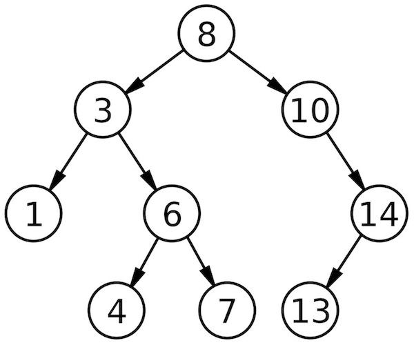

# BSTIterator

An implementation of the Iterator design pattern, for the Binary Search Tree data structure. A great 
explanation of BSTs can be found in this 
[video tutorial](https://www.youtube.com/watch?v=i_Q0v_Ct5lY).

### What It Does

This iterator assumes that the given binary search tree inserts nodes of smaller 
value to the left, and nodes of larger value to the right of current node. Accordingly, 
this iterator will return nodes according to "In Order" binary tree traversal. 
This means that given a binary search tree like the following, the iterator would 
return values in order: 1, 3, 4, 6, 7, 8, 10, 13, 14. 

  

### How It's Done

**The trivial solution** to a binary search tree iterator would be to construct a List (or similar 
linear data structure) when you construct the BSTIterator. This would require traversing the entire
BST, adding each node value to your list as you go. The downside to the trivial solution is twofold.
You're front loading the work by requiring the BSTIterator's constructor to traverse the entire tree, 
and you're taking up more memory by maintaining (worst case) every node in the tree in a separate 
data structure. In Big O terms, here are the costs, where n is the number of nodes in the tree:
* Constructor Run Time: O(n) 
* `next()` Run Time: O(1)
* `hasNext()` Run Time: O(1)
* Extra Space: O(n)

**A better solution** is to maintain _only_ the path to the next smallest node. For instance, given 
the BST above, when you first create your BSTIterator, instead of traversing the entire tree, you 
would navigate to the next smallest node (in this case, 1), pushing nodes onto a stack along the way. 
Your BSTIterator Constructor would look like:
```
private ArrayDeque<TreeNode> pathStack;

public BSTIterator(TreeNode root) {
  pathStack = new ArrayDeque<>();
  pushPathToNextSmallest(root);
}

private void pushPathToNextSmallest(TreeNode node) {
  while (node != null) {
    pathStack.push(node);
    node = node.getLeft();
  }
}
```

After the constructor is called our BST, your `pathStack` would look like this:

1\
3\
8

This way, you're certain of what the next smallest node is because it lives on top of your path 
stack. In order to maintain the integrity of this path stack, when you call `next()` and pop a 
node off the stack, you must check to see if it has a right child. If it does, then you must follow the right 
child's path to the next smallest node (pushing onto your path stack as you go). Given our above example, 
calling `next()` on our BSTIterator twice would return node "3". Node "3" has a right child, indicating 
a path to a node smaller than 3's parent. In this case, you would push node "6" onto the stack, 
and node "4" onto the stack. `next()` would look like this:

```
public TreeNode next() throws IllegalStateException {
  // If the user calls next() and hasNext() is false
  if (pathStack.isEmpty()) {
    throw new IllegalStateException();
  }
  var next = pathStack.pop();
  // follow right child to next smallest node
  pushPathToNextSmallest(next.getRight());
  return next;
}
```

**Key Concept:** The path to the smallest node of a given subtree is navigating straight to the 
leftmost node of that subtree.

In Big O terms, here are the costs for our improved solution, where h is the height of the tree:
* Constructor Run Time: O(h) 
* `next()` Amortized Run Time: O(1)
* `hasNext()` Run Time: O(1)
* Extra Space: O(h)

As you can see, this solution more evenly distributes the work. It yields the same amortized 
runtime for `next()`, reduces the run time of the constructor, and uses less extra space.
